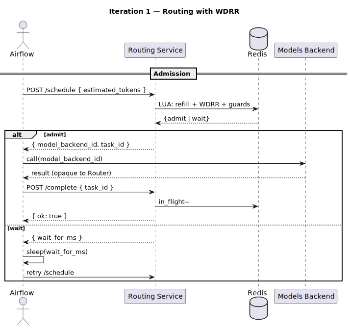
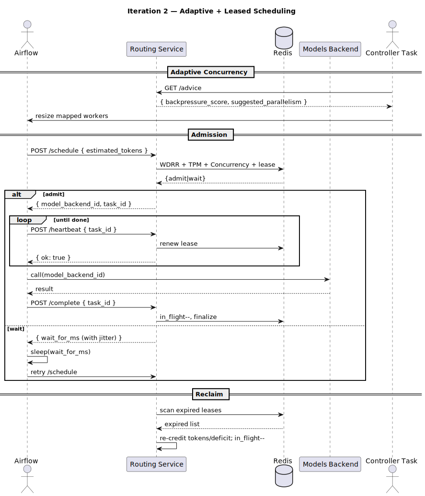

# LLM Load Balancer

A pragmatic, quota-aware task router and orchestration layer for fanning out prompts across a fixed set of LLM models. The goal: keep per-model traffic under control, chew through backlogs faster, and play nicely with the existing Models Backend.

---

## Current Setup (As-Is)

### Components
- **PostgreSQL**
  - Stores tasks to be solved by LLMs (prompt, status solved/unsolved, answer, etc.). New tasks are ingested regularly from multiple sources.

- **Python / FastAPI “Models Backend”**
  - Exposes two endpoints:
    - `single`: solve one prompt.
    - `batch`: solve multiple prompts; splits into parallel model calls under the hood.
  - There are **10 available models**. Single-prompt latency varies **~1s–2m**. The batch endpoint responds **only after all tasks in the batch complete**.

- **Airflow**
  - Orchestrates background processes that may call the Models Backend.

### Workflow
1. An Airflow DAG fetches **all new unsolved tasks**, then splits them into **20 equal batches**. 
2. The DAG launches **20 mapped workers**; each processes its assigned batch. 
3. Each worker sends a **batch of 10 tasks** to the Models Backend, then writes answers + `solved` status back to Postgres.  
4. The worker pulls the **next batch of 10** and repeats. 
5. Workers have a **30-minute timeout**. After all workers finish or time out, the **DAG restarts**.


---

## Problem Statement

We’re optimizing for two outcomes while **preserving the existing Models Backend** (calls must go through it; other pieces can be reorganized and the DB schema may evolve):

1. **Controlled traffic per model**  
   - Define a **target traffic rate** for each model and enforce it. Targets must be **easily adjustable at any time** (e.g., when quotas change).

2. **Faster end-to-end solving**  
   - Identify current bottlenecks and implement an approach that both **honors per-model traffic limits** and **reduces total time to solve the task set**.

> **Constraint:** Keep using the existing Models Backend for model calls; everything else (orchestration, batching strategy, schema) is fair game for improvement.

# Iteration 1 — Routing Service with WDRR

A lightweight routing microservice that enforces **per-model traffic shaping** while keeping the **existing Models Backend** as the only way to call models. The goal is to improve **end-to-end solving speed** and **stay within per-model targets**, without changing how Airflow or the Models Backend is called externally.

---

## Scope & Fit (why this iteration matches the brief)

- Preserves the **Models Backend** as the mandatory call path.
- Provides an **implementation diagram** and **pseudocode for key parts**.
- Enables **adjustable per-model traffic targets** (via weights and refill rates) to handle quota changes.
- Targets **faster solving** by smoothing bursts, keeping models busy without overruns, and reducing batch-level tail latency.

---

## Core Idea

A **Routing Service** sits between Airflow and the Models Backend. It schedules each task admission using **Weighted Deficit Round Robin (WDRR)**, gated by:

- a **token-per-minute bucket** (soft throughput),
- a **concurrency semaphore** (hard in-flight cap),
- and **per-model weight** (share of service).

State (deficits, token buckets, in-flight counters) lives in **Redis** for low-latency updates.

---

## How it works (TL;DR)

1. **Airflow** asks the router to schedule a task: `POST /schedule` with a single input **`estimated_tokens`**.
2. Router replies **either**:
   - `{"wait_for_ms": <int>}` → caller sleeps and retries `POST /schedule`, **or**
   - `{"model_backend_id": "<string>", "task_id": "<string>"}` → caller immediately invokes the Models Backend; then calls `POST /complete` with **`task_id`** when done.
3. Router updates Redis on admit/complete and returns minimal bounded waits when capacity isn’t available, keeping the Models Backend as-is.

---

## Scheduling Model (WDRR + Concurrency + TPM)

- **WDRR (fair share):** Each model `m` holds a `deficit[m]`. Every scheduling loop adds `weight[m]` to `deficit[m]`. If `deficit[m] >= estimated_tokens`, the model is eligible (subject to the guards below). On admit, `deficit[m] -= estimated_tokens`.
- **Concurrency guard (hard cap):** Only admit if `in_flight[m] < max_concurrent_requests[m]`. Prevents queue explosion and protects the Models Backend.
- **TPM bucket (soft rate):** `tokens[m]` refills continuously at `max_tokens_per_minute[m] / 60` per second. Only admit if `tokens[m] >= estimated_tokens`; on admit, `tokens[m] -= estimated_tokens`. Burst-friendly and simple for v1.
- **Wait strategy:** If nothing can admit, compute the **shortest time** until **either** a token refill suffices **or** a likely in-flight release, and return `wait_for_ms` so Airflow retries efficiently (keeps Airflow stateless and idempotent, as desired).

---

## Airflow Integration

Airflow still runs its DAGs but delegates admission to the router:

1. `POST /schedule { "estimated_tokens": <int> }`
2. If `{"wait_for_ms": N}`, sleep `N` then retry step 1.
3. If `{"model_backend_id": X, "task_id": T}`, call **Models Backend** with `X`, then
4. `POST /complete { "task_id": T }`

---

## API (v1)

### Request scheduling

```http
POST /schedule
Content-Type: application/json

{
  "estimated_tokens": 1800
}
```

**Fields**

- `estimated_tokens` (int): Router needs a size proxy to decide if a model’s **deficit**, **token bucket**, and **in-flight slot** can admit the task now. Using tokens aligns with rate limits and WDRR arithmetic.

**Success responses** (mutually exclusive)

```json
{ "wait_for_ms": 250 }
```

- `wait_for_ms` (int): Minimal suggested wait before retry; computed from nearest token refill or expected slot release. Keeps Airflow from hot-looping while avoiding long sleeps.

```json
{ "model_backend_id": "gpt-4o-mini", "task_id": "tsk_01H..." }
```

- `model_backend_id` (string): The specific model to call on the **existing Models Backend** (unchanged external behavior).  
- `task_id` (string): Router’s admission handle for releasing in-flight capacity on completion.

### Mark completion

```http
POST /complete
Content-Type: application/json

{
  "task_id": "tsk_01H..."
}
```

**Field**

- `task_id` (string): Identifies the admitted unit so the router can **decrement in-flight** and finalize accounting. No other data is required for v1; admission-time accounting already debited tokens/deficit.

---

## Pseudocode — Scheduler Core

```pseudo
state:
  for each model m:
    weight[m]                  // configured share
    max_concurrent_requests[m] // hard in-flight cap
    max_tokens_per_minute[m]   // soft throughput
    deficit[m] = 0
    tokens[m]  = max_tokens_per_minute[m]     // allow initial burst
    in_flight[m] = 0
  last_refill_ts = now()

function refill_tokens(now_ts):
  dt_sec = max(0, now_ts - last_refill_ts)
  if dt_sec == 0: return
  for m in models:
    tokens[m] = min(max_tokens_per_minute[m],
                    tokens[m] + dt_sec * (max_tokens_per_minute[m] / 60.0))
  last_refill_ts = now_ts

function schedule(estimated_tokens):
  now_ts = now()
  refill_tokens(now_ts)

  // WDRR round: add quanta first
  for m in models:
    deficit[m] += weight[m]

  // Try to admit in a single pass to avoid head-of-line blocking
  candidate = NONE
  for m in round_robin_order():
    if deficit[m] >= estimated_tokens and
       in_flight[m] < max_concurrent_requests[m] and
       tokens[m]  >= estimated_tokens:
         candidate = m
         break

  if candidate != NONE:
    m = candidate
    deficit[m] -= estimated_tokens
    tokens[m]  -= estimated_tokens
    in_flight[m] += 1
    task_id = new_task_id()
    store_task_for_model(m, task_id)
    return { "model_backend_id": model_name(m), "task_id": task_id }

  // Compute minimal wait
  waits = []
  for m in models:
    need_tokens = max(0, estimated_tokens - tokens[m])
    token_wait_ms =
      (need_tokens <= 0) ? 0 :
      ceil( (need_tokens / (max_tokens_per_minute[m] / 60.0)) * 1000 )

    slot_wait_ms =
      (in_flight[m] < max_concurrent_requests[m]) ? 0 :
      SHORT_BACKOFF_MS   // e.g., 100–250ms; we don't guess durations

    // require both resources; wait for the slower of the two for this model
    waits.append( max(token_wait_ms, slot_wait_ms) )

  return { "wait_for_ms": min_positive(waits, default=DEFAULT_RETRY_MS) }

function complete(task_id):
  m = lookup_model_for(task_id)
  if m == NONE
    return { "error": "Task not found" }
  in_flight[m] = max(0, in_flight[m] - 1)
  remove_task(m, task_id)
  return { "ok": true }
```

---

## Pseudocode — Redis Data Access (atomic paths)

```pseudo
// All writes use Lua scripts or MULTI/EXEC to keep counters consistent.

HASH model:m        -> weight, max_concurrent_requests, max_tokens_per_minute
HASH runtime:m      -> deficit, tokens, in_flight
KEY  last_refill_ts -> epoch milliseconds

LUA schedule_lua(estimated_tokens):
  // 1) refill based on dt
  // 2) add weight to each deficit
  // 3) find first admissible m
  // 4) commit admit or compute min wait
  // 5) return JSON blob as string
```

---

## PlantUML — Sequence (v1 flow)



---

## Operational Notes

- **Adjustability:** Change `weight`, `max_concurrent_requests`, and `max_tokens_per_minute` per model at runtime to reflect quotas and priorities.
- **Simplicity first:** Token bucket is intentionally approximate to keep v1 simple; WDRR evens out service share while concurrency caps protect the backend.
- **Compatibility:** No changes to the external Models Backend API or Airflow DAG contract are required to adopt this router.


# Iteration 2 — Adaptive Backpressure, Leases, and Faster End-to-End

This iteration tightens control loops and removes failure gaps while still **calling models only via the existing Models Backend** (core requirement). It introduces: (1) **adaptive parallelism advice** to avoid over/under-subscription, (2) **lease + heartbeat** to survive Airflow restarts and 30-minute timeouts, and (3) **latency/throughput optimizations** to shave wall-clock time across the set.

---

## What needed improvement (from v1 and the brief)

- **Fixed concurrency (20 workers)**: Can overload quotas or leave capacity idle; not responsive to changing model limits.  
- **30-minute worker timeout & DAG restart**: In-flight work can be abandoned; router doesn’t receive completions for those tasks.  
- **Batch tail latency**: Batch endpoint replies only after all complete → long tails slow overall completion.  
- **Token estimation + per-minute refill**: Coarse timing can cause short bursts of `wait_for_ms` oscillations and thundering retry herds.

---

## Speed bottlenecks (first, the truth)

1. **Batch endpoint tail**: One slow call stalls the whole batch response path.  
2. **Static 20 workers**: Either floods a scarce model or starves a roomy one; both reduce global throughput.  
3. **Head-of-line in WDRR when estimates are large**: Big `estimated_tokens` tasks monopolize deficits/tokens.  
4. **Retry sleeps**: Short, uniform sleeps create synchronized retries (mini-stampedes) that don’t align with true capacity recovery.

---

## How we speed it up (solutions)

- **Prefer single-prompt calls (when possible)** through the existing **Models Backend “single” endpoint** to eliminate batch tails; if batching is required upstream, use **micro-batches** sized by router admission rather than fixed 10s. (We still only call via the Models Backend.)  
- **Adaptive parallelism**: Router produces a **backpressure score** and a **suggested_parallelism**; the DAG scales mapped workers toward that target instead of a fixed 20.  
- **Size-aware WDRR**: Keep WDRR, but add an **“age bonus”** to deficits so large tasks don’t starve smaller ones indefinitely.  
- **Smarter waits**: Return **jittered, minimal waits** aligned to the next token refill boundary or expected slot release, reducing herd effects.  
- **Leases + heartbeats**: Make in-flight work resilient to Airflow restarts/timeouts; the router can reclaim abandoned leases and re-admit safely.

---

## Additions in Iteration 2

### A) Adaptive Backpressure & DAG Concurrency Advice

The router aggregates recent `wait_for_ms` and admit outcomes into a rolling **backpressure score** and emits a **suggested_parallelism** for the next scheduling window. Airflow reads this and adjusts the number of mapped workers accordingly (start small, ramp up, then hold steady).

#### Endpoint: get scheduling advice

```http
GET /advice
```

**Response**

```json
{
  "backpressure_score": 0.42,
  "suggested_parallelism": 14
}
```

- `backpressure_score` (float 0–1): 0 means no observed pressure (waits rare/small); 1 means frequent long waits (hot congestion).  
- `suggested_parallelism` (int): Router’s recommended total concurrent **Airflow workers** for the next window, based on recent admits/waits across all models.

#### Pseudocode — computing advice

```pseudo
window = last 60s rolling metrics
let p95_wait_ms = percentile(wait_for_ms_stream, 95, window)
let admit_rate  = admits_in_window / schedule_calls_in_window
let inflight    = sum(in_flight[m] for m in models)

backpressure_score =
  clamp( 0.5 * normalize(p95_wait_ms, low=25ms, high=1000ms)
       + 0.5 * (1 - admit_rate), 0, 1 )

capacity_headroom =
  sum(max_concurrent_requests[m] for m in models) - inflight

suggested_parallelism =
  clamp( inflight
       + round( capacity_headroom * (1 - backpressure_score) )
       , min=4, max=sum(max_concurrent_requests[m]) )
```

Airflow controller task polls `/advice` periodically and **resizes mapped tasks** next run (or dynamically if supported) to follow `suggested_parallelism`.

---

### B) Leases, Heartbeats, and Reclaim (survive timeouts/restarts)

We add a **lease** to each admission so the router can detect abandonment if Airflow dies or the DAG restarts at 30 minutes.

#### Changes to Router (new endpoint + semantics)

1) **`/schedule`** (unchanged request/response) now returns an additional internal lease created server-side.  
2) **Heartbeat**

```http
POST /heartbeat
Content-Type: application/json

{
  "task_id": "tsk_01H..."
}
```

3) **Reclaim (automatic)**  
If a lease is **not** heartbeated within `lease_ttl_ms` (router-side constant), the router:
- marks the task as **abandoned**,
- **decrements** the in-flight counter,
- **credits back** the appropriate tokens/deficit,
- exposes the task for re-admission.

#### Pseudocode — lease lifecycle

```pseudo
on schedule(estimated_tokens) admit:
  lease = { task_id, model=m, expires_at=now()+lease_ttl_ms }
  store lease; in_flight[m]++

on heartbeat(task_id):
  lease = get lease
  if lease exists:
    lease.expires_at = now() + lease_ttl_ms
    return { "ok": true }
  else:
    return { "ok": false, "reason": "not_found" }

reclaimer_loop():
  for each expired lease:
    m = lease.model
    in_flight[m] = max(0, in_flight[m]-1)
    tokens[m]    = min(cap, tokens[m] + refund_for(lease))
    deficit[m]   = deficit[m] + refund_for(lease)
    mark_abandoned(task_id)
```

---

### C) Size-Aware WDRR and Wait Jitter

```pseudo
deficit[m] += weight[m] + age_bonus(m)
wait_for_ms = nearest_capacity_ms * uniform(0.9, 1.1)
```

---

### D) Smoothed Retry Timing (Anti-Stampede Backoff)

To prevent synchronized retry bursts when all workers receive similar `wait_for_ms` values:

- Each `wait_for_ms` returned by `/schedule` is **jittered** ±10 % around the calculated minimum,  
  so retries are desynchronized and capacity recovers smoothly.
- Router also applies a **rate-aligned wait floor**: it rounds `wait_for_ms` to the nearest
  upcoming token-refill tick (e.g., next 100 ms boundary) instead of arbitrary small sleeps,
  ensuring workers wake up when actual capacity exists.

#### Pseudocode
```pseudo
base_wait_ms = min_wait_for_capacity()
jitter = uniform(-0.1 * base_wait_ms, +0.1 * base_wait_ms)
aligned_wait_ms = ceil_to_tick(base_wait_ms + jitter, TOKEN_REFILL_INTERVAL_MS)
return { "wait_for_ms": max(50, aligned_wait_ms) }
```

---

## Updated API (v2 additions only)

```http
GET /advice
POST /heartbeat
```

---

## PlantUML — Resilient + Adaptive Flow



---

## Best Practice Alignment

- **Backpressure-driven concurrency** replaces static fan-out with dynamic control.
- **Leases + heartbeats** are standard for safe re-delivery on crashes/timeouts.
- **Existing Models Backend** remains the only model-call path, keeping architecture consistent with the assignment.
