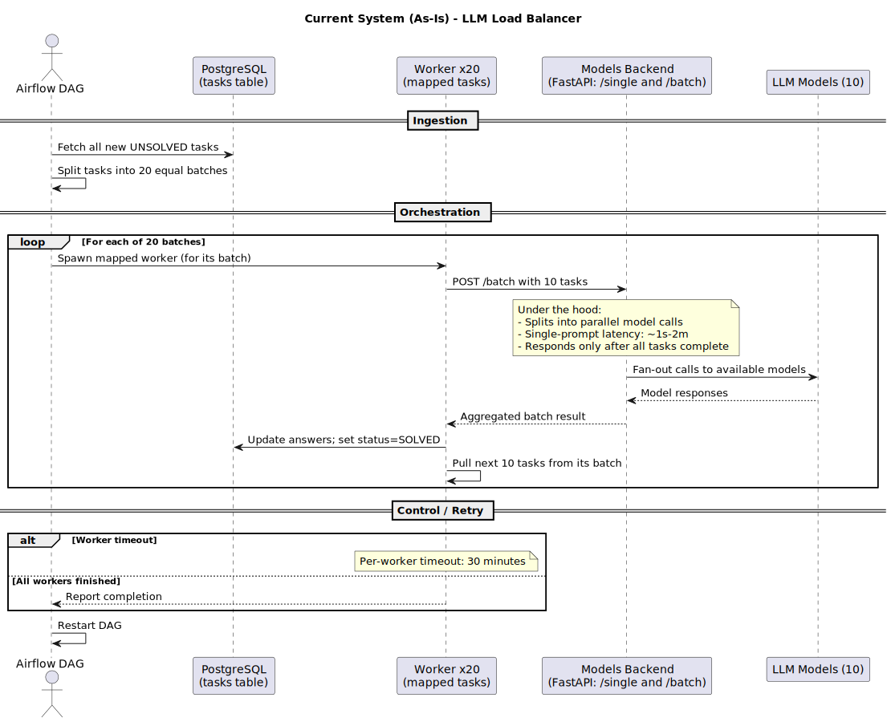

# LLM Load Balancer

A pragmatic, quota-aware task router and orchestration layer for fanning out prompts across a fixed set of LLM models. The goal: keep per-model traffic under control, chew through backlogs faster, and play nicely with the existing Models Backend.

---

## Current Setup (As-Is)

### Components
- **PostgreSQL**
  - Stores tasks to be solved by LLMs (prompt, status solved/unsolved, answer, etc.). New tasks are ingested regularly from multiple sources.

- **Python / FastAPI “Models Backend”**
  - Exposes two endpoints:
    - `single`: solve one prompt.
    - `batch`: solve multiple prompts; splits into parallel model calls under the hood.
  - There are **10 available models**. Single-prompt latency varies **~1s–2m**. The batch endpoint responds **only after all tasks in the batch complete**.

- **Airflow**
  - Orchestrates background processes that may call the Models Backend.

### Workflow
1. An Airflow DAG fetches **all new unsolved tasks**, then splits them into **20 equal batches**. 
2. The DAG launches **20 mapped workers**; each processes its assigned batch. 
3. Each worker sends a **batch of 10 tasks** to the Models Backend, then writes answers + `solved` status back to Postgres.  
4. The worker pulls the **next batch of 10** and repeats. 
5. Workers have a **30-minute timeout**. After all workers finish or time out, the **DAG restarts**.

---

## Problem Statement

We’re optimizing for two outcomes while **preserving the existing Models Backend** (calls must go through it; other pieces can be reorganized and the DB schema may evolve):

1. **Controlled traffic per model**  
   - Define a **target traffic rate** for each model and enforce it. Targets must be **easily adjustable at any time** (e.g., when quotas change).

2. **Faster end-to-end solving**  
   - Identify current bottlenecks and implement an approach that both **honors per-model traffic limits** and **reduces total time to solve the task set**.

> **Constraint:** Keep using the existing Models Backend for model calls; everything else (orchestration, batching strategy, schema) is fair game for improvement.
